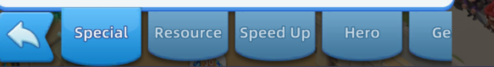
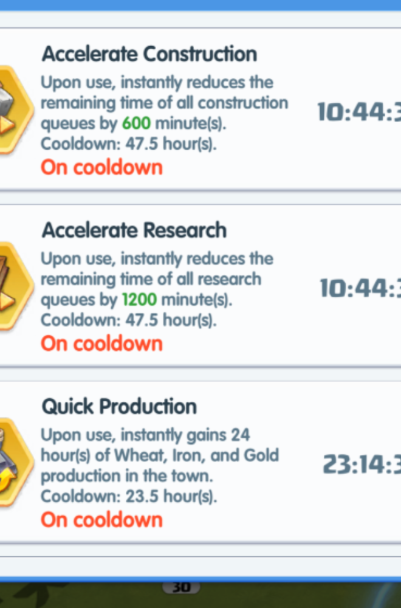
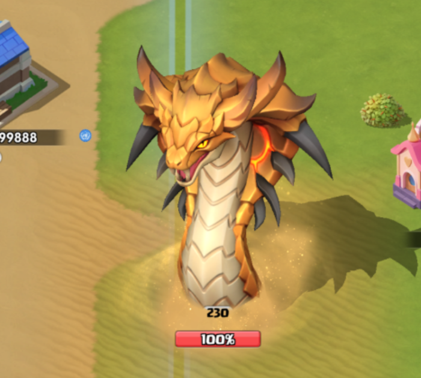
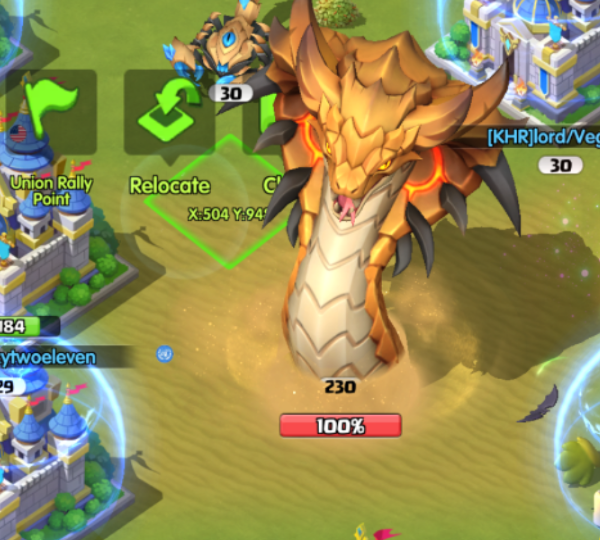

# Game UI Changes & Template Fixes (2026-07 wave)

The game shipped a UI restyle in early July 2026 that silently broke several
template-driven flows. This documents each change, the fix, and the screenshot
evidence — plus the giant-boss (Hydra) rally mechanics discovered in the same
window. All coordinates 4K.

## Bag: tab bar restyled (new "Speed Up" tab)

Order is now **Special | Resource | Speed Up | Hero | Gems** — Speed Up was
inserted, shifting Hero right.

| What broke | Fix |
|-----------|-----|
| Special active/inactive templates stale → "Failed to switch, still on hero", Special never claimed | re-extracted `bag_special_tab_active_4k.png` / `bag_special_tab_4k.png` (badge-free crop) |
| Hero click at old (2200,2070) → inter-tab gap → Hero never scanned | pixel-measured **Hero (2268, 2065)** (tabs evenly spaced 221px from Special@1605). NOTE: Gemini located it at 2161 — wrong, that activates Resource. Trust template-match + even-spacing math over Gemini for small UI |
| Use dialog "not detected" → chests clicked but 0 claimed | the dialog FLOATS vertically with item-description length; `USE_BUTTON_REGION` started at y=1400 while the button renders at y≈1383 for short descriptions. Widened to `(1650, 1250, 550, 500)` |

Live-verified after the fixes: `Special=10, Hero=2` claimed in one run.

## Royal City: "Unoccupied" tab → "Vacancy" row

The city panel was redesigned; the old Unoccupied tab is gone. New detector:
crown + "Vacancy" row, template `royal_city_unoccupied_tab_4k.png`
(re-extracted), region `(1450, 650, 900, 200)`, threshold **0.04** (unrelated
panels score ~0.05+). Post-detection reinforce steps may still need adapting —
untestable until the Friday window.

## Class Skill panel: timers are on the RIGHT

`read_class_skills` (feeds the dashboard portal + the Quick Production
pre-check) had three bugs:

1. It OCR'd the LEFT effect text for the cooldown and parsed "23.5 hour(s)" as
   "5h". The real timers sit on the RIGHT at `(2140, cy-55, 350, 115)` —
   verified reading `10:39:49` / `23:09:45` cleanly.
2. `_parse_skill_block` split on newlines but OCR returns one line → `name`
   swallowed the whole description. Now splits on the "Upon use"/"Cooldown"
   markers.
3. Scheduler mismatch: `record_flow_run` backdated with the STALE per-entry
   `cooldown_seconds` (86400) while `is_flow_ready` used the config value
   (68400 after the 19h change). The 18000s gap turned QP's 305-min skip
   cooldown into a **5-minute retry** — quick_production re-ran all day. Both
   sides now use the config cooldown (and the stale entry self-heals).

Row anchoring is unchanged and correct: match `quick_production_icon_4k.png`
(row 3, cy≈1410), step up by `CLASS_SKILL_ROW_PITCH=348` for rows 2 and 1.

## Giant world bosses (Hydra): a different rally UI

The Hydra reuses the cobra/python event icon (left toolbar row), and
`desert_python_rally_flow` handles it — but giant bosses behave differently
from the small trapped python:

1. Tapping the toolbar icon only **re-centers the camera** on the boss — no
   panel opens (the small python's panel opens directly):

2. You must tap the **monster body** — `GIANT_MONSTER_TAP = (1660, 850)`
   (dragon-type bosses measured at (1770,833); tune per boss via the step
   screenshots). Careful: tapping left of the body hits the floating
   "Relocate" button.

3. Selection pops **floating action buttons around the sprite**, not a bottom
   panel — and the rally control is a **GREEN "Rally Point" flag on the LEFT**
   (template `monster_rally_flag_4k.png`, region `(1050, 380, 700, 600)`), NOT
   the python's red bottom-panel `rally_button_4k.png`:

Flow logic: poll for the red flag first (small python path); if absent, tap
the body and poll for the green flag (giant boss path). Step screenshots
`02b_giant_monster_greenflag*` / `03_deploy_launch*` record each stage. The
deploy screen past the green flag is still blind-calibrated — check the step
shots on the first full live run.

## Meta-lessons from this wave

- When "a ton of stuff stopped working" at once, separate **game restyles**
  (stale templates/coords) from **automation regressions** — this wave had
  both, and the broken idle tracker masked the restyle breakage.
- Extract templates from **capture frames of real runs**, verify self-match
  ≈0.0 AND cross-check against negative frames before trusting a threshold.
- Gemini object detection is unreliable for small UI elements (tab buttons,
  toolbar icons) — use template matching + measured spacing; Gemini is fine
  for large sprites (the dragon body).
- The action-capture before/after frames are the ground truth for "what did
  that click actually do" — use them before theorizing.
