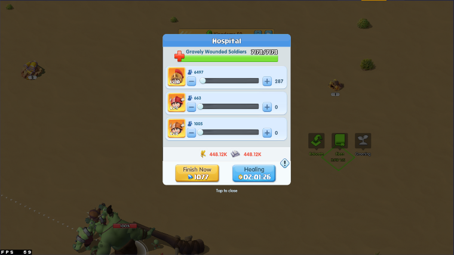
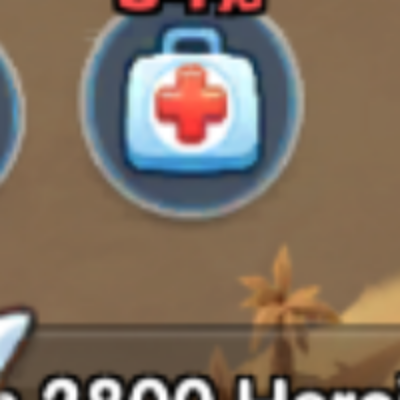
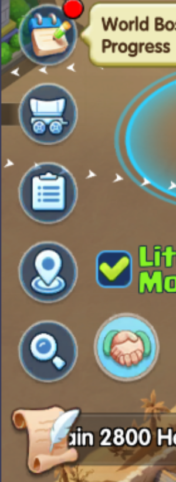
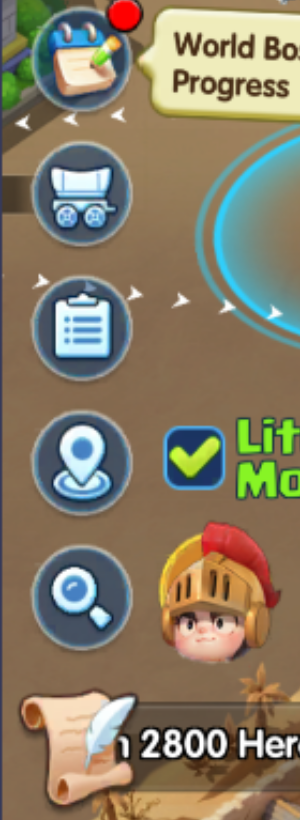
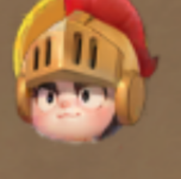

# Hospital Healing & Alliance Help (2026-07-11)

Everything about the healing automation: the hospital state machine, the
alliance-help button on the left toolbar, and the bugs that made "auto heal"
silently dead for a while. All coordinates are 4K (3840x2160).

## The hospital state machine (top-right bubble)

`utils/hospital_state_matcher.py` reads the bubble over the hospital building
at region `(3312, 344, 61, 67)`, click position `(3342, 377)`. States:

| Bubble | State | Daemon action |
|--------|-------|---------------|
| handshake | HELP_READY | tap → requests ally help |
| stopwatch | TRAINING | none |
| green cross | HEALING | open panel + `hospital_healing_flow` |
| yellow soldier | SOLDIERS_WOUNDED | open panel + `hospital_healing_flow` |
| (none match) | IDLE | none |

Perception (`TrackerSpec("hospital_votes", {TOWN}, 2.0, ...)`) samples the
state every ~2s **only in TOWN** and feeds a 10-reading vote history; the main
loop dispatches when a state wins the vote **and** the user is idle
(`IDLE_THRESHOLD`, 30s via config_local).

### Vote thresholds (and why they differ)

- **HELP_READY: 3/10** — the handshake bubble is ANIMATED; measured scores are
  bimodal 0.002 (in phase) ↔ 0.079 (out of phase), so wrong-phase readings vote
  IDLE and a 60% majority is unreachable for long stretches. A 0.002 match has
  no false-positive mode, so 3 hits = proof.
- **HEALING / WOUNDED: 6/10** (classic 60% rule).

### The healing flow itself

`scripts/flows/hospital_healing_flow.py` assumes the hospital panel is OPEN:
verifies `hospital_header_4k.png` (region `(1770,305,300,90)`, 5s poll), finds
plus-button rows, fills ONLY the bottom row (highest-level soldiers), ratios
the slider down if the heal time exceeds the resource limit, clicks Healing at
`(2148, 1477)`, and handles the insufficient-resources replenish tab.

### Bugs fixed 2026-07-10/11 (each verified live)

1. **Blind tap from the wrong view** — help/heal/wounded actions tapped
   `(3342,377)` without navigating; perception votes in TOWN but the action
   often fired from WORLD → the tap hit the world map, every heal "failed at
   panel not open". Now ALL hospital actions (including the manual `healing`
   trigger) route through `IconDaemon._open_hospital_bubble()`: return to
   TOWN (verified via detect_view, 3 tries), then tap. Don't gate that tap on
   a fresh bubble match — the bubble animates and the just-after-nav frame is
   often transitional; the vote history already proved a bubble exists.
2. **Vote history wiped by view flapping** — the loop reset
   `hospital_state_history=[]` on EVERY non-TOWN frame, and the view flaps
   TOWN↔WORLD every ~10s. Perception got ~5 votes in before each wipe → the
   10-vote threshold was NEVER reached → wounded soldiers sat unhealed for
   hours ("definitely not auto healing"). The reset now only applies when the
   LOOP owns the votes (`not _votes_owned_by_perception()`); perception's
   tracker is already TOWN-gated so a WORLD blip must not erase its votes.
3. **Invisible failures** — the flow printed errors to stdout (lost for a
   hidden daemon). All prints are logger calls now; the panel-open check
   polls 5s instead of one-shot after a fixed sleep.

## Alliance-help button (left toolbar)

A second, separate help surface: a round button on the LEFT toolbar,
immediately RIGHT of the magnifying-glass icon. Click center **(213, 1496)**,
search region **(120, 1400, 220, 200)**. It shows one of THREE icons — and
they are **different request types, not one button's states**:

| Icon | Meaning | Click result | Automated? |
|------|---------|--------------|------------|
|  blue medkit ("NN%" badge) | ally asked for HEALING | opens the Hospital healing panel | **YES** → `healing_flow` |
| handshake | chat/help ping | opens **CHAT** | no (never auto-click) |
| golden helmet | ranking ping | opens **Point Ranking** | no (never auto-click) |

Daemon behavior (`ASSIST_LEFT_*` in `icon_daemon.py`): every loop, if
`HOSPITAL_HEAL_ENABLED` and `assist_help_briefcase_4k.png` matches (masked,
threshold 0.06), click (213,1496), wait 2.5s for the panel, run
`healing_flow`. 30s cooldown so a heal can finish. Verified live: 4
detections → heals completed, 0 wrong clicks.

Handshake / helmet columns for reference:

### Masked templates (background-independent)

The button floats over the map, so plain SQDIFF fails on busy backgrounds.
Masks were built by **diffing each icon on two different backgrounds** (pixels
that stay constant = icon; pixels that change = background/badge):

- Templates: `assist_help_{briefcase,handshake,helmet}_4k.png` + masks.
- **Mask naming**: the matcher expects `<name>_mask_4k.png` — i.e. it replaces
  the FIRST `_4k.png`. `assist_help_briefcase_4k_mask_4k.png` is WRONG and
  silently ignored (scores went 0.13 on the second background); renamed to
  `assist_help_briefcase_mask_4k.png` → 0.0003 on both backgrounds.
- Masked matching uses TM_CCORR with custom normalization (see
  `utils/template_matcher.py`).

### Hazard: the helmet is a chat avatar look-alike

A world-chat-feed avatar renders a pixel-identical golden helmet at nearly the
same spot; even masked matching cannot separate them (0.000 both):

An earlier auto-clicker tapped an off-center (224,1518) and opened Union chat
repeatedly. Rules learned: only the **briefcase** is auto-clicked, always at
the exact **(213,1496)** center, and left-edge taps in general are chat
territory (UNKNOWN-recovery edge clicks at (100,1080)/(1920,2050) used to
strand the daemon in chat and were removed).
